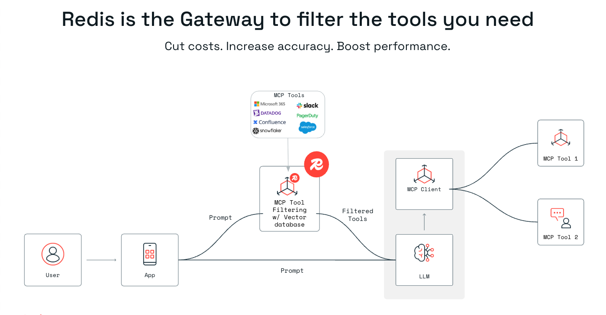

# Redis MCP Latency Reduction Demo

A technical demonstration of performance optimization for Model Context Protocol (MCP) tool selection using Redis vector search and semantic caching.

## Background



MCP servers expose numerous tools to LLM applications, creating a context scaling challenge. As tool inventories grow (80+ tools across multiple servers), sending all tools to the LLM for every request becomes inefficient: increasing latency, token consumption, and costs. 

This demo implements a two-stage optimization: Redis vector search pre-filters tools based on semantic similarity to the query, reducing the LLM's context from 85 tools to 2-3 relevant ones. Combined with semantic caching for repeated queries, which achieves latency reduction while maintaining selection accuracy.

## Architecture

### Core Components

- **FastAPI Backend** (`app.py`): Main application server handling API requests and orchestrating tool selection
- **Vector Search Index**: Redis HNSW index for semantic similarity search across MCP tools
- **Semantic Cache**: TTL-based cache for similar query responses
- **Embedding Service**: SentenceTransformers for generating 384-dimensional embeddings
- **LLM Integration**: OpenAI GPT-4 for final tool selection from pre-filtered candidates

## Installation

### Configuration

1. Copy the example configuration file:
```bash
cp config.py.example config.py
```

2. Edit `config.py` and replace all instances of `"STUB_VALUE"` with your actual credentials:
   - Redis URL, host, port, and password
   - OpenAI API key

### Start

```bash
./setup.sh
```

## Technical Implementation

### Vector Search Strategy

The application uses Redis Vector Similarity Search (VSS) with HNSW indexing:

```python
# Index configuration
tool_schema = {
    "index": {
        "name": "mcp_tools",
        "prefix": "tool:",
        "storage_type": "hash",
    },
    "fields": [
        {"name": "embedding", "type": "vector", "attrs": {
            "dims": 384,
            "distance_metric": "cosine",
            "algorithm": "hnsw",
            "datatype": "float32"
        }}
    ]
}
```

Tool embeddings are generated using enhanced semantic text that includes:
- Tool name and description
- Server context and operation type
- Parameter descriptions for richer semantic understanding

### Semantic Caching

The cache uses vector similarity to match semantically similar queries:

```python
# Cache similarity threshold
PERFORMANCE_CONFIG = {
    "cache_similarity_threshold": 0.85,
    "cache_ttl": 300,  
    "enable_semantic_cache": True
}
```
Only read operations are cached to maintain data consistency.

### Tool Selection Pipeline

1. **Query Embedding**: Generate vector representation of user query
2. **Vector Search**: Find top-k similar tools using Redis VSS (8ms average)
3. **LLM Refinement**: Send pre-filtered tools to GPT-4 for final selection
4. **Response Caching**: Store query request responses with embedding for future similarity matching

## Troubleshooting

### Redis Connection Issues
```bash
# Test Redis connectivity
redis-cli -h <host> -p <port> ping

# Check Redis logs
redis-cli monitor
```

### Embedding Generation Failures
```bash
# Verify sentence-transformers installation
python3 -c "from sentence_transformers import SentenceTransformer; print('OK')"

# Force reindex tools
curl -X POST http://localhost:3001/api/debug/reindex
```

### Performance Issues
```bash
# Check cache statistics
curl http://localhost:3001/api/performance/stats

# Monitor real-time logs
DEBUG=* python3 app.py
```