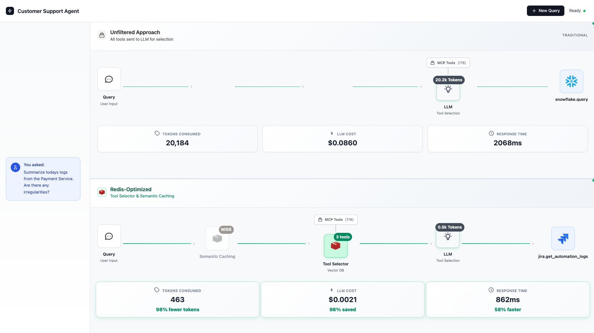

# Redis MCP Tool Filtering Demo

## Overview

Customer Support Engineers handle incidents across multiple tools: Zendesk tickets, Datadog alerts, Confluence runbooks, etc. When automating this with MCP agents, you can access 170+ tools across these services. But sending all tool schemas in every request causes inaccurate tool selection, high token costs, and slow responses. This demo uses Redis vector search to pre-filter tools before the LLM sees them, finding the 2-3 most relevant tools. This reduces context size by 98% while providing accurate semantic search, significantly lower token costs, and real-time performance.

**What this demo does:** Run a web interface where you can submit customer support queries (e.g., "Create a high priority incident regarding a payment service outage"). The demo compares two approaches side-by-side: sending all 170+ tools to the LLM (baseline) vs. using Redis to filter to the top 2-3 relevant tools first (optimized). You'll see the difference in response time, token usage, and tool selection accuracy.


*Side-by-side comparison showing token usage, cost, and response time differences between unfiltered and Redis-optimized approaches* 

## Prerequisites

- Python 3.10-3.13 (recommended)
  - 3.9 and below: Not supported (transformers requires 3.10+)
  - 3.14+: May have dependency issues (numpy/torch wheels)
- Redis instance 
- OpenAI API key

## Installation

### 1. Verify Python Version

```bash
python3 --version  # Should be 3.10-3.13
```

### 2. Configure

```bash
cp config.py.example config.py
```

Edit `config.py` and fill in 3 values at the top:

```python
# 1. Redis endpoint from Redis Cloud dashboard
_redis_endpoint = "redis-12345.c62.us-east-1-4.ec2.redns.redis-cloud.com:12345"

# 2. Redis password
_redis_password = "your-password-here"

# 3. OpenAI API key
_openai_api_key = "sk-proj-your-key-here"
```

Everything else is configured automatically.

### 3. First Time Setup

```bash
./setup.sh
```

This installs all dependencies and starts the server (5-10 minutes, ~500MB download).

```
http://localhost:3001
```

### 3. Subsequent Runs

After initial setup, start the server everytime with:

```bash
./run.sh
```

## Troubleshooting

**Python version errors:** Use Python 3.10-3.13 from https://python.org/

**Permission denied:** `chmod +x setup.sh run.sh`

**ModuleNotFoundError:** Run `./run.sh` or activate venv: `source venv/bin/activate`
